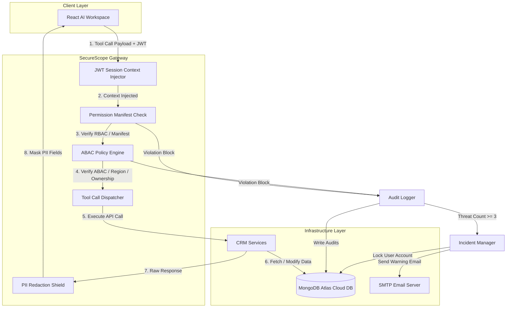

# Enterprise AI Security Gateway & Tool Proxy: SecureScope Blueprint

## 1. Problem Statement

Modern enterprise applications increasingly delegate operations to autonomous AI agents that run on Large Language Models (LLMs). These agents are equipped with tools (such as database readers, CRM write APIs, and delete commands) to perform tasks dynamically. 

However, this integration introduces severe security risks:
* **The Confused Deputy Vulnerability**: The AI agent operates with high-level database connection strings or master API tokens. If an attacker injects a malicious prompt (Prompt Injection) or a user asks the agent to perform an action outside their role, the agent acts as a "confused deputy," abusing its system-level authority to read unauthorized data or delete records.
* **Lack of Scope Awareness**: Standard database firewalls and network API gateways inspect static headers and HTTP payloads. They do not know the active user's session state, meaning they cannot verify if Customer A is allowed to read Order B.
* **Reconnaissance & Probing**: Attacking agents or malicious users often perform scanning or probing operations (e.g. trying random customer IDs) to discover weak points in access control policies.

---

## 2. Technical Architecture Blueprint

The **SecureScope Gateway** is a scope-aware security proxy positioned between the AI agent and the underlying CRM database services. It intercepts, validates, and sanitizes every single tool call.

---

## 3. Core Feature Implementation Deep-Dive

### Feature A: Authentication & Authorization (Session Security)
* **JWT Token Authentication**: Every client session is bound to a secure JSON Web Token (JWT) containing cryptographically signed user metadata (`sub` containing the ID, `role_name`, and a unique `session_id`). The token is verified on every request.
* **Cryptographic Password Hashing**: User credentials are protected using `bcrypt` salting and hashing during registration. Plaintext passwords are never stored in the database.
* **Secure Welcome SMTP Credentials Delivery**: When a user is approved, the system generates a cryptographically secure 12-character random temporary password, hashes it to the database, and delivers it directly to the customer’s inbox using standard SMTP email. The password is never shown in the UI.

### Feature B: Policy Simulation Engine (High Priority)
The gateway features a complete "What-If" security sandbox allowing administrators to dry-run and evaluate policy variations before applying them live.
* **Sandbox Environment**: Administrators can modify role-based permissions (e.g., check *"Update Customer Records"* for a Customer, or uncheck *"Approve Orders"* for a Manager) and toggle ABAC rules (e.g., limit Managers to their own region).
* **Allowed vs. Blocked Metrics**: Replays historical session logs against the simulated configuration and compares results to calculate exact metrics:
  * **Access Maintained**: Requests allowed under both policies.
  * **New Access Blocks**: Requests previously allowed but blocked by the new policy.
  * **New Access Opens**: Requests previously blocked but allowed by the new policy.
  * **Still Blocked**: Requests blocked under both policies.
* **Simulation Reason Resolution**: The simulator outputs a descriptive simulation reason explaining the decision (e.g., *"Ownership Violation: Customer cannot access details of 'CUS000016'"* or *"Permitted by simulated policy"*).
* **Impact Analysis Reports**: Dynamically charts the *Simulation Transition Ratio* to prevent deployment of broken or over-restrictive security rules.

### Feature C: Human-in-the-Loop (HITL) Lifecycle
* **Approval Queues**: Highly sensitive operations—such as profile updates, account deletions, and customer registrations—cannot be executed directly by lower-privileged roles (like Managers or Customers).
* **Pending Tasks Manager**: These requests are automatically redirected into a `PendingCustomer` or `PendingCustomerUpdate` table. A Human Admin or Manager must review the requests in their **Pending Tasks** dashboard and explicitly click **Approve** or **Reject** to write the changes to the live tables.
* **Dynamic Badge Counts**: A red alert badge is rendered in the sidebar showing the exact number of pending tasks, reducing in count as items are resolved.

### Feature D: Attack Replay Center
* **Historical Replays**: Administrators can load and replay historical tool call logs (batches of 10, 50, 100, etc.) through the gateway proxy to test their security boundaries against past scanning behaviors or known security incidents.

### Feature E: PII Output Redaction Shield
* **Dynamic Response Inspection**: All REST response payloads and tool results are processed by a PII Redaction module.
* **RegEx Masking**: Scans data fields for sensitive patterns and masks them (e.g. credit card numbers, Aadhaar numbers, PAN numbers, emails, and phone numbers are replaced with `[REDACTED]`) based on the role's clearance level.

### Feature F: Probing Countermeasures & Lockouts
* **Threat Meter Scoring**: Tracks user violations inside the active session context. Displays a threat score in the admin workspace:
  * `1 Violation`: Warning
  * `2 Violations`: High Risk
  * `3 Violations`: Critical (Account Lockout)
* **Session Disabling**: When a session reaches 3 blocks, the gateway marks the session status as `Terminated` in the database, automatically logging the client out.
* **Account Suspension**: The user's profile status is modified to `Suspended` (or `Inactive`).
* **SMTP Incident Alerts**: Instantly delivers a formal warning notice email to the user explaining that their account has been suspended due to security violations.

### Feature G: Real-Time Cloud Persistence
* **MongoDB Atlas Cloud Database**: All customer profiles, employee records, order states, session models, audit logs, and security policies are stored dynamically in a cloud-hosted MongoDB Atlas cluster, satisfying the concurrency and persistence requirements.

---

## 4. Key Security Concepts Reference

1. **Role-Based Access Control (RBAC)**: Validates permissions based on the user's declared role (e.g., Admin, Manager, Customer).
2. **Attribute-Based Access Control (ABAC)**: Dynamically checks attributes at runtime, such as comparing the customer's region to the manager's region or checking order status.
3. **Least Privilege Principle**: Restricts AI tools so that the agent can never execute command-level queries beyond what the active session user is authorized to perform.
4. **Bcrypt**: A blowfish-based key derivation function used for secure password storage.
5. **JSON Web Token (JWT)**: An open standard (RFC 7519) for transmitting secure, compact claims between the frontend client and the API gateway.
